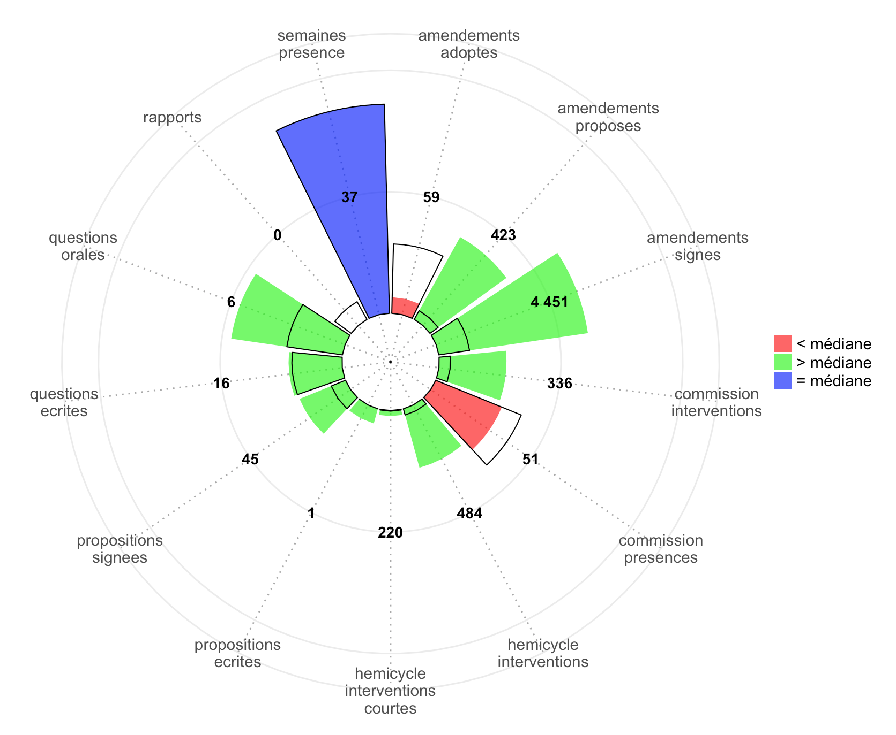

# Déput-O-Score

Le **Déput-O-Score** a pour objectif de donner un aperçu rapide de l'activité d'un député, sur la base des [données d'activité des parlementaires](https://github.com/regardscitoyens/nosdeputes.fr/blob/master/doc/api.md#données-dactivité-des-parlementaires) portant sur la synthèse des 12 derniers mois, telles que collectées par le site [nosdeputes.fr](https://www.nosdeputes.fr/).

## Démonstration

Un site de démonstration est disponible à cette adresse : https://mcaradec.shinyapps.io/Deput-O-Score/.

L'hébergement est assuré par **[shinyapps.io by RStudio](https://www.shinyapps.io/)**, avec un [plan de consommation](https://www.shinyapps.io/#_pricing) gratuit. Le site peut donc être provisoirement indisponible si tous les crédits sont consommés.

## Outils & Technologies

- [R](https://cran.r-project.org/).
- [Shiny](http://shiny.rstudio.com/).
- [RStudio](https://www.rstudio.com/).
- [Visual Studio Code](https://code.visualstudio.com).

## Licence

Ce projet est sous licence **Creative Commons** [Attribution - Pas d’Utilisation Commerciale - Partage dans les Mêmes Conditions 4.0 International](https://creativecommons.org/licenses/by-nc-sa/4.0/deed.fr).

