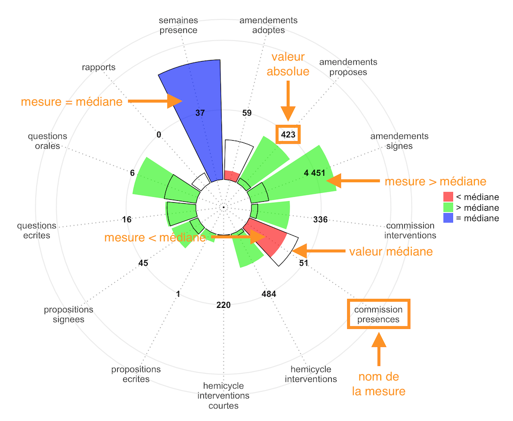

### Foire aux questions

#### A quoi correspondent les métriques

| Métrique | Colonne | Description |
|---|---|---|
| Semaines d'activité | `semaines presence` | Nombre de semaines où le député a été relevé présent en commission, a pris la parole (même brièvement) dans l'hémicycle ou a participé physiquement à un scrutin public. |
| Présences en Commission | `commission presences` | Nombre de réunions de commission où le député a été relevé présent. |
| Interventions en Commission | `commission interventions` | Nombre d'interventions prononcées par le député dans les commissions. |
| Interventions longues en Hémicycle | `hemicycle interventions` | Nombre d'interventions de plus de 20 mots prononcées par le député en hémicycle. |
| Interventions courtes en Hémicycle | `hemicycle interventions courtes` | Nombre d'interventions de 20 mots et moins prononcées par le député en hémicycle. |
| Amendements proposés | `amendements proposes` | Nombre d'amendements proposés par le député (indiqué « auteur » par l'Assemblée). |
| Amendements signés | `amendements signes` | Nombre d'amendements proposés ou co-signés par le député. |
| Amendements adoptés | `amendements adoptes` | Nombre d'amendements signés par le député qui ont été adoptés en séance. |
| Rapports écrits | `rapports` | Nombre de rapports ou avis dont le député est l'auteur. |
| Propositions de loi écrites | `propositions ecrites` | Nombre de propositions de loi ou de résolution dont le député est l'auteur. |
| Propositions de loi signées | `propositions signees` | Nombre de propositions de loi ou de résolution dont le député est cosignataire. |
| Questions écrites | `questions ecrites` | Nombre de questions écrites soumises par le député au gouvernement. |
| Questions orales | `questions orales` | Nombre de questions orales posées par le député au gouvernement. |

*Descriptions reprises du site [nosdeputes.fr](https://www.nosdeputes.fr/synthese).*

Pour plus d'informations, veuillez vous reporter au site [nosdeputes.fr](https://www.nosdeputes.fr/synthese).

#### Quelle échelle est utilisée

Les mesures représentants des faits de différentes natures, avec des échelles hétérogènes, leur affichage sur un même graphique les rendrait difficilement lisibles.

Afin de restituer des ordres de grandeur comparables, toutes les mesures ont été normalisées afin d'avoir la même échelle allant de **0 à 100**, selon la formule `x_normalisé = x / max(X) * 100`.

*Voir aussi [Feature scaling](https://en.wikipedia.org/wiki/Feature_scaling).*

#### Comment interpréter le graphique

Chaque segment correspond à une mesure :

- La mesure [médiane](https://fr.wikipedia.org/wiki/M%C3%A9diane_%28statistiques%29), portant sur l'ensemble des députés. Elle est affichée en transparence, avec une bordure noir.
- La mesure propre au député. Elle est affichée avec une couleur qui est fonction de sa position par rapport à la mesure médiane :

| Couleur | Description |
|---|---|
| Rouge | Valeur de la mesure **inférieure** à la médiane. |
| Vert | Valeur de la mesure **supérieure** à la médiane. |
| Bleu | Valeur de la mesure **égale** à la médiane. |

Chaque segment est complété avec un montant indiquant sa valeur absolue (exemple : le nombre de rapports écrits).

#### Comment est calculé le score

Le score est la moyenne des mesures.

Toutes les mesures sont prises en compte, à l'exception du nombre d'amendements adoptés.

Les mesures étant toutes transposées sur une échelle de **0 à 100**, le score maximum est de **100**.

#### A quoi correspond l'émoticône

<link rel="stylesheet" href="https://use.fontawesome.com/releases/v5.7.2/css/all.css" integrity="sha384-fnmOCqbTlWIlj8LyTjo7mOUStjsKC4pOpQbqyi7RrhN7udi9RwhKkMHpvLbHG9Sr" crossorigin="anonymous">

L'émoticône affiché varie en fonction de la position du score par rapport aux [quartiles](https://fr.wikipedia.org/wiki/Quartile).

| Description | Emoticône | Emoticône ASCII |
|---|---|---|
| 25% les plus faibles. | &nbsp;<i class="far fa-frown fa-2x"></i> | `:-(` |
| 50% les plus faibles. | &nbsp;<i class="far fa-meh fa-2x"></i> | `:-|` |
| 50% les plus forts. | &nbsp;<i class="far fa-smile fa-2x"></i> | `:-)` |
| 25% les plus forts. | &nbsp;<i class="far fa-grin fa-2x"></i> | `:-D` |
